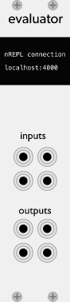
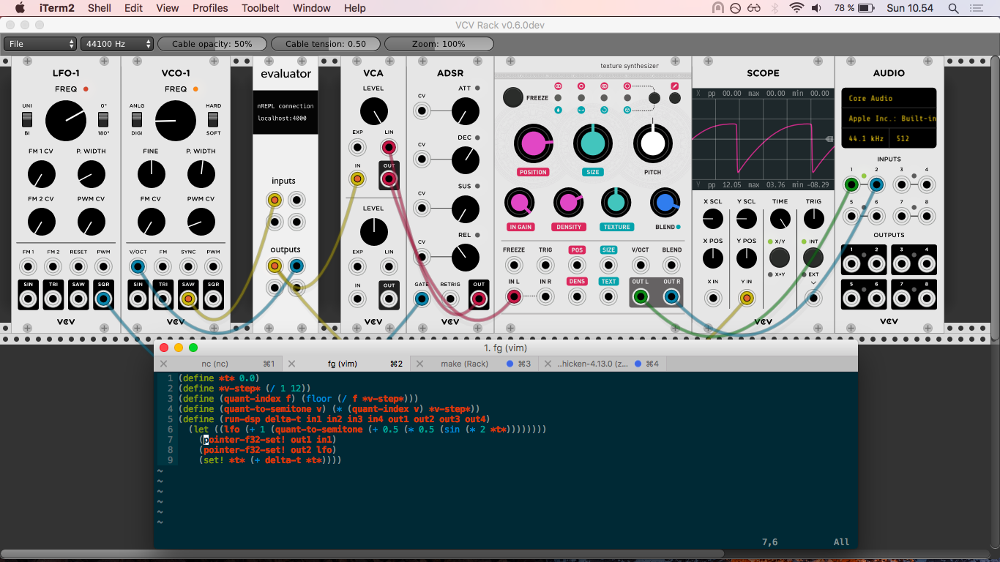

# A programmable 4 in 4 out module for VCV Rack

Have you always wanted to do live programming on a module? Look no further. This thing can become a logic module, a
sequencer, an LFO – anything you want! Just jack-in to the nREPL exposed at `localhost:4000` and get cracking.

Currently requires Chicken Scheme and nrepl -library installed via Homebrew. Will fix this at some point. Maybe.

## Contributing

I welcome Issues and Pull Requests to this repository if you have suggestions for improvement.

## Licence

Have not decided on this yet. Chicken Scheme is BSD-styled so maybe something like that.

